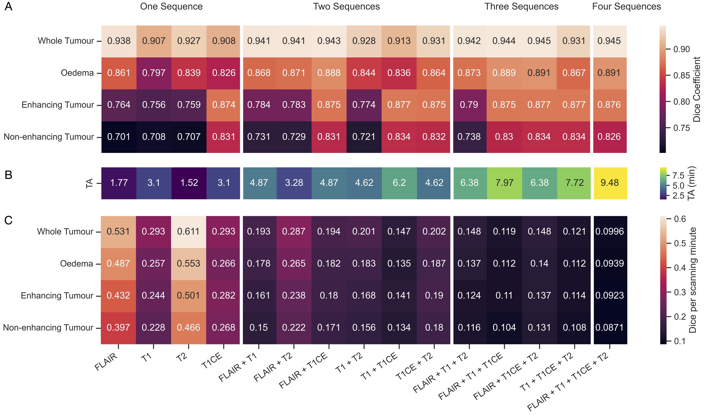

# Brain tumour segmentation with incomplete imaging data

This is a repository for all models detailed in the article [Brain tumour segmentation with incomplete imaging data](https://arxiv.org/abs/2206.06120).


## What is this repository for?
Brain tumour segmentation is **difficult in real-world practice**. Clinical imaging is very **heterogenous**.

Most brain tumour segmentation models available require multimodal MRI with four structural sequences: FLAIR, T1-weighted, T2-weighted, and contrast-enhanced T1-weighted sequences (T1CE)

But this ‘perfect’ and complete data is **often rare in clinical practice** 

We provide a solution to this problem with a modelling framework able to utilise any possible combination of these four MRI sequences, for both brain tumour tissue class segmentation (enhancing tumour, non-enhancing tumour, and perilesional oedema), and general abnormality detection.

This work substantially extends the translational opportunity for quantitative analysis to clinical situations where the full complement of sequences is not available, and potentially enables the characterisation of contrast-enhanced regions where contrast administration is infeasible or undesirable.


## Anticipated performances for specific sequence combinations
Models trained on incomplete data can segment lesions very well, often equivalently to those trained on the full completement of images, exhibiting Dice coefficients of 0.907 (single sequence) to 0.945 (complete set) for whole tumours, and 0.701 (single sequence) to 0.891 (complete set) for component tissue types. This opens the door both to the application of segmentation models to large-scale historical data, for the purpose of building treatment and outcome predictive models, and their application to real-world clinical care. A heatmap of model performances across all sequence combinations and tissue classes is shown below.


**Performance of all model combinations.** A) Heatmap illustrates the validation Dice coefficient across all models, for both whole tumour and the individual components. Models are partitioned into those which utilized just one sequence, two, three and finally the complete four- sequence model. A brighter orange/white box depicts a better performing model as per the Dice coefficient. B) Second heatmap depicts the relative acquisition time (TA) (in minutes) for the sequences used for a given model, with a more green/yellow box illustrating a longer acquisition time. C) Third heatmap illustrates the performance gain in Dice coefficient per minute of acquisition time. The mathematical derivation of the Dice coefficient is given in the methods. Colour keys are given at the right of the plot.

## Detecting enhancing tumour without contrast-enhanced imaging
Not all patients can receive intravenous contrast for post-contrast MRI sequence acquistion.
For example, patients allergic to contrast, those in renal failure who cannot receive it, or where contrast use should be minimised (regular follow-up).

We show that segmentation models can detect enhancing tumour in the absence of contrast-enhancing imaging, quantifying the burden of enhancing tumour with an R2 > 0.97, varying negligibly with lesion morphology. Such models can quantify enhancing tumour without the administration of intravenous contrast, 


**Examples of segmenting enhancing tumour without contrast.** A-C) Left two columns and rows of each panel illustrate the anatomical imaging for three randomly selected cases, whilst the third column of each panel illustrates the hand-labelled ground truth shown with the overlayed T1CE image, and finally the model prediction where contrast imaging was not provided. Of note, the case in panel B comprised a tumour with only a 7mm diameter enhancing component. D) The volume of enhancing tumour is highly significantly correlated to that of all model predictions, even when contrast-enhanced imaging is not provided (quantified by linear regression).

## Usage instructions
1. Install [nnU-Net v1](https://github.com/MIC-DKFZ/nnUNet/tree/nnunetv1)
2. Downlaod our [moodel weights](www.google.com)
3. Follow the [instructions for model inference with nnU-Net](https://github.com/MIC-DKFZ/nnUNet/tree/nnunetv1#run-inference)


## Example usage
```
nnUNet_predict -i INPUT_FOLDER -o OUTPUT_FOLDER -t TASK_NAME_OR_ID -f all
```


## Citation
Please cite the following [paper](https://arxiv.org/abs/2206.06120) when using our models

James K Ruffle, Samia Mohinta, Robert Gray, Harpreet Hyare, Parashkev Nachev. Brain tumour segmentation with incomplete imaging data. Brain Communications. 2023. DOI 10.1093/braincomms/fcad118


## Usage queries
Via github issue log or email to j.ruffle@ucl.ac.uk


## Funders
The Wellcome Trust; UCLH NIHR Biomedical Research Centre; Medical Research Council; Guarantors of Brain; NHS Topol Digital Fellowship
